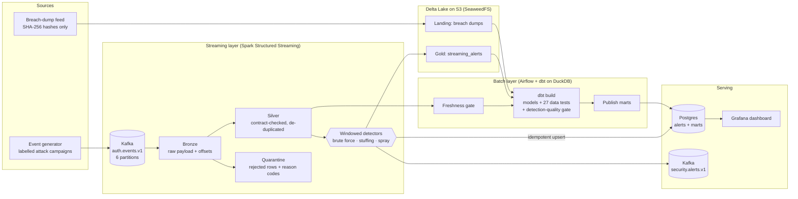
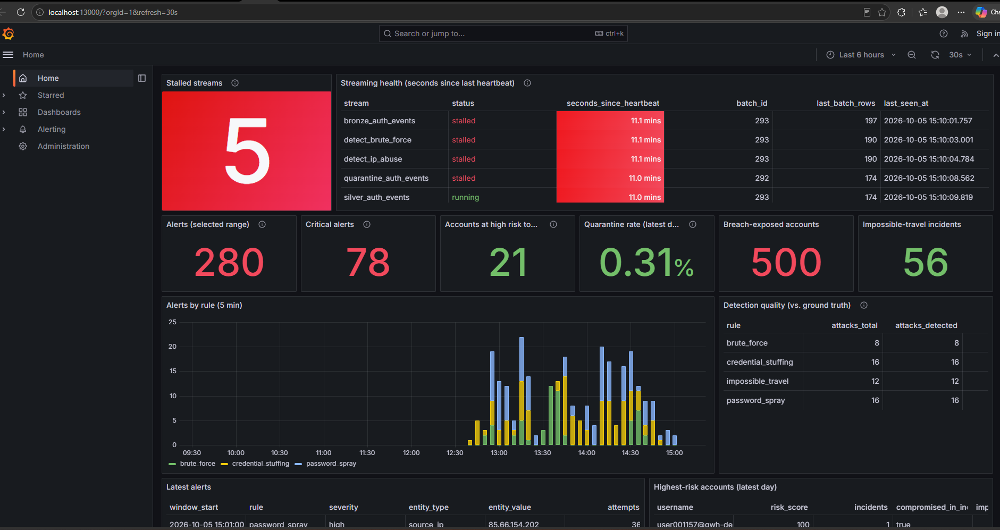
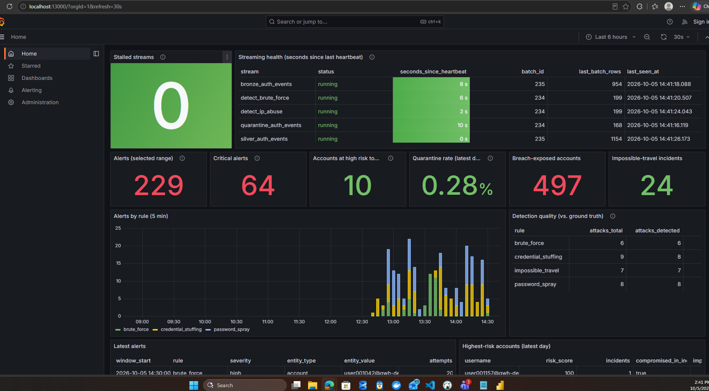

# Sentinel Lakehouse

**Real-time credential-abuse and account-takeover detection on a streaming + batch lakehouse.**

Sentinel ingests authentication events from Kafka, lands them in a Delta Lake medallion
architecture on S3-compatible storage (SeaweedFS locally, Amazon S3 in the cloud), detects brute force, credential stuffing and password
spraying in real time with Spark Structured Streaming, and runs an hourly dbt layer for the
questions that need history: impossible travel, breach exposure, per-user risk, and how well
the real-time rules are actually performing.

Everything runs locally with one command, and an offline mode runs the full pipeline in CI
in about 30 seconds without Docker.


---

## Architecture



| Layer | Technology | Why |
|---|---|---|
| Transport | Kafka 3.8 (KRaft) | Durable, replayable log. Keyed by username so each account's events stay ordered within a partition. |
| Stream processing | Spark 3.5 Structured Streaming | Event-time windows, watermarks, and exactly-once file sinks. Same code scales from `local[*]` to a cluster. |
| Table format | Delta Lake 3.2 on SeaweedFS (S3 API) | ACID appends from streams, time travel for audits, idempotent writes via `txnAppId`/`txnVersion`. |
| Transformations | dbt + DuckDB | Version-controlled SQL with tests. DuckDB reads Delta directly, so the batch layer needs no cluster. |
| Orchestration | Airflow 2.10 | Hourly DAG with retries, a freshness gate, and single-writer concurrency control. |
| Serving | Postgres + Grafana | Low-latency reads for dashboards; marts swapped in atomically so readers never see partial loads. |

## Results (offline demo, 3 simulated hours, ~62k events)

The simulator labels every attack, and the pipeline scores itself against those labels. The
detectors never see the labels.

| Rule | Path | Attacks | Detected | Incidents | False positives | Precision | Recall | Median time to detect |
|---|---|---:|---:|---:|---:|---:|---:|---:|
| brute_force | streaming | 12 | 12 | 12 | 0 | 1.00 | 1.00 | 1.5 min |
| credential_stuffing | streaming | 11 | 11 | 11 | 0 | 1.00 | 1.00 | 0.9 min |
| password_spray | streaming | 11 | 11 | 11 | 0 | 1.00 | 1.00 | 1.2 min |
| impossible_travel | batch | 18 | 18 | 60 | 0 | 1.00 | 1.00 | at login |

These numbers are not where the project started. The first version of the brute-force rule
had **0.43 precision**, and the CI quality gate failed the build. See
[docs/detection-tuning.md](docs/detection-tuning.md) for how that was diagnosed and fixed.
Synthetic data separates attacks from normal traffic more cleanly than production would, so
treat these figures as a regression baseline, not a benchmark.

## Performance (live stack on a Windows laptop, Docker Desktop)

Measured with the built-in load test (`make loadtest`, see
[docs/operations.md](docs/operations.md#load-testing)) while normal traffic kept flowing:

| Measure | Result |
|---|---|
| Attack to alert (brute force, 3/3 probes detected) | median 249 s, max 266 s |
| Producer rate | 126,975 events/s |
| Bronze throughput (100,000 event burst) | 4,148 events/s, backlog cleared in 24 s |
| Silver throughput (100,000 event burst) | 1,488 events/s, backlog cleared in 67 s |

- **Headroom.** Normal traffic is about 5 events/s, so a single laptop absorbs roughly 300 times
  the everyday load, and a sudden 100,000-event spike is fully validated and de-duplicated in
  about a minute.
- **Latency is a design choice, not a compute limit.** About 2 of the 4 minutes is the
  watermark waiting for late events, up to 1 is the 5-minute window sliding to its next
  boundary, and the rest is three 30-second micro-batch stages. A shorter watermark and
  trigger interval would cut it, at the cost of dropping more late events.
- **Silver is the bottleneck.** It waits for bronze to commit, then runs validation and
  stateful de-duplication. It is the first stage to split into its own Spark application
  (`--stages silver`) when volume grows.

## Quick start

### Option A: offline pipeline (no Docker, about 30 seconds)

Requires Python 3.10 to 3.12 and Java 17.

```bash
python -m venv .venv && source .venv/bin/activate
make install
make test     # 29 unit tests: generator, data-quality rules, detectors (batch + streaming)
make demo     # generate -> Spark bronze/silver/alerts -> dbt gold layer + tests -> report
```

### Option B: full streaming stack

Requires Docker with about 8 GB of memory.

```bash
cp .env.example .env
make up
```

| Service | URL | Login |
|---|---|---|
| Grafana dashboard | http://localhost:13000 | anonymous viewer |
| Airflow | http://localhost:18080 | admin / admin |
| Spark UI | http://localhost:14040 | |
| Kafka UI (optional) | http://localhost:18085 | `docker compose --profile ui up -d` |
| Postgres (DBeaver, psql) | localhost:15432, database `sentinel` | sentinel / sentinel (read-only: grafana / grafana) |

To measure attack-to-alert latency and throughput on the running stack, see
[Load testing](docs/operations.md#load-testing) (`make loadtest`).

On Windows, `.\scripts\start.ps1` starts the stack (and a shared Airflow, if you use one),
then waits until every check passes; `.\scripts\check.ps1` re-runs the checks any time.

Only these web UIs and a localhost-only Postgres port are published to your machine, on
uncommon ports so the stack runs next to other local projects. Kafka and the object store
stay on the internal Docker network. Change any port in `.env`.

Already running an Airflow for other projects? Turn the bundled one off and run
`sentinel_batch` in yours instead: see [docs/shared-airflow.md](docs/shared-airflow.md).

Events start flowing immediately. Real-time alerts appear in Grafana within a few minutes,
once the first windows close past the watermark. The batch panels fill after the first
hourly Airflow run, or right away with `make batch`.

## Design decisions

**Bronze keeps the raw payload.** Bronze stores the Kafka message exactly as received with
its partition and offset. Parsing happens in silver. When a contract or a rule changes,
silver and the alerts can be rebuilt from bronze (`make backfill`) without re-reading Kafka.

**A data contract with a quarantine, not silent nulls.** Silver validates every event
(timestamp, outcome enum, IPv4 format, coordinate ranges, required ids). Failures go to a
quarantine table with reason codes rather than being dropped or coerced, and
`mart_data_quality_daily` tracks the rejection rate. The generator injects about 0.3%
malformed records so this path is always exercised.

**Duplicates are expected.** The producer is at-least-once, and the generator replays about
0.4% of events to simulate retries. Silver de-duplicates on `event_id` using
`dropDuplicatesWithinWatermark`, which keeps state bounded by the watermark instead of
growing forever.

**Every sink is idempotent.** Alert ids are a hash of (rule, entity, window start), so a
micro-batch replayed after a crash produces the same ids. Delta appends use
`txnAppId`/`txnVersion`, Postgres uses `ON CONFLICT DO NOTHING`, and Kafka messages are keyed
by alert id.

**One set of transforms for stream and batch.** Every function in
[`transforms.py`](src/sentinel/streaming/transforms.py) works on both batch and streaming
DataFrames. The unit tests run the detectors on small in-memory fixtures *and* as real
structured streams, which proves every operator is streaming-compatible. The backfill job
calls the same functions, so a backfill and the live stream agree by construction.

**Streaming for volume, batch for history.** Brute force, stuffing and spraying are
volumetric patterns inside a five-minute window, so they run in the stream. Impossible
travel needs each user's previous login, which is a cheap window function in SQL but
expensive to hold as streaming state for every account, so it runs in dbt.

**Detection quality is a test.** `mart_detection_quality` computes precision, recall and
time-to-detect per rule. A dbt test fails the build if any rule drops below 0.8 on either,
and CI runs the whole pipeline on every push. Tuning a threshold therefore comes with a
measurable before and after.

**Hard negatives are built in.** A third of Houston staff share one office NAT IP, so one IP
sees hundreds of distinct users. Some users forget a password and fail eight to fourteen
times. Legitimate travellers change cities at realistic speeds. Each of these would trigger a
naive rule, and each one has a test.

**Streams that hang get restarted, not ignored.** A streaming job can stall without
failing. Every micro-batch is a heartbeat; a watchdog thread exits the job if any query goes
silent for 10 minutes, so the container restarts from its checkpoints. The same heartbeats
back a Docker healthcheck (`docker compose ps` shows `healthy`) and a Grafana panel showing
seconds since each query last made progress ([operations runbook](docs/operations.md)).

| Storage frozen: every stream goes silent | Unfrozen: streams recover and catch up |
|---|---|
|  |  |

In the recovery batch, bronze and silver processed 954 and 1,154 rows against about 170
normally: the backlog Kafka held while storage was down, with no events lost.

**Problems reach a person.** Grafana alert rules, provisioned from Git, email (and optionally post to Microsoft Teams) when a
stream stalls or the detectors go quiet, with a runbook link in every message. A third rule
pages the security team on a likely account takeover.

**Privacy by design.** The breach feed contains only SHA-256 email hashes and SHA-1
password hashes (the Have I Been Pwned format). Exposure is found by hashing our own
usernames in silver and joining. A dbt test fails if anything other than a 64-character hex
digest reaches the breach table.

## Scaling path

The local stack runs on one machine. Here is what changes as volume grows, without
rewriting the pipeline code:

| Pressure | Change |
|---|---|
| More events | Add Kafka partitions (keyed by username, so per-account order holds); raise `maxOffsetsPerTrigger`. |
| Stream compute | Point `spark-submit --master` at Kubernetes or a standalone cluster. Run bronze, silver and detection as separate applications (`--stages`) and scale each one on its own. |
| Streaming state | Already on the RocksDB state store, so state lives off-heap and checkpoints incrementally. |
| Multi-cluster writes to S3 | Configure Delta's DynamoDB LogStore for safe concurrent commits. |
| Batch layer outgrows one node | Switch the dbt adapter from `dbt-duckdb` to `dbt-spark` or `dbt-trino`. The models are plain SQL apart from two small macros. |
| Table maintenance | Schedule Delta `OPTIMIZE` (with Z-order on `username`, `src_ip`) and `VACUUM` as an Airflow task. |

## Repository layout

```
src/sentinel/
  generator/      simulator with labelled attack campaigns, Kafka and file sinks
  streaming/      contracts, transforms, streaming pipeline, alert sinks, batch replay
  serving/        freshness gate and Postgres publisher used by Airflow
dbt/sentinel/     staging -> intermediate -> marts, schema tests, quality gates
airflow/dags/     hourly gold-layer DAG
grafana/          provisioned datasource and dashboard
infra/postgres/   roles, alerts table, read-only dashboard grants
docker/           images for Spark, Airflow and the generator
tests/            unit tests, including streaming-mode tests
docs/             detection tuning, operations runbook, shared-Airflow setup
```

## Data model

| Layer | Table | Grain |
|---|---|---|
| Bronze | `bronze/auth_events` | One Kafka message, raw |
| Silver | `silver/auth_events` | One unique, validated auth event |
| Silver | `quarantine/auth_events` | One rejected message, with reason codes |
| Gold | `gold/streaming_alerts` | One rule firing for one entity in one window |
| Mart | `fct_security_incidents` | One incident (overlapping windows merged), both detection paths |
| Mart | `fct_impossible_travel` | One physically impossible pair of logins |
| Mart | `dim_exposed_accounts` | One internal account found in a breach dump |
| Mart | `mart_user_risk_daily` | One user per day, with an explainable 0 to 100 risk score |
| Mart | `mart_detection_quality` | One rule: precision, recall, time-to-detect |
| Mart | `mart_data_quality_daily` | One ingest day: accepted vs. quarantined, by reason |

## Roadmap

- Schema registry (Avro/Protobuf) with compatibility checks in CI
- ML anomaly scoring (isolation forest on per-user login features) next to the rules
- Session-window detectors for low-and-slow attacks that spread across many windows
- Terraform module for AWS (MSK, EMR Serverless, S3, MWAA)
- Load-test harness reporting events per second and end-to-end latency

## License

MIT
